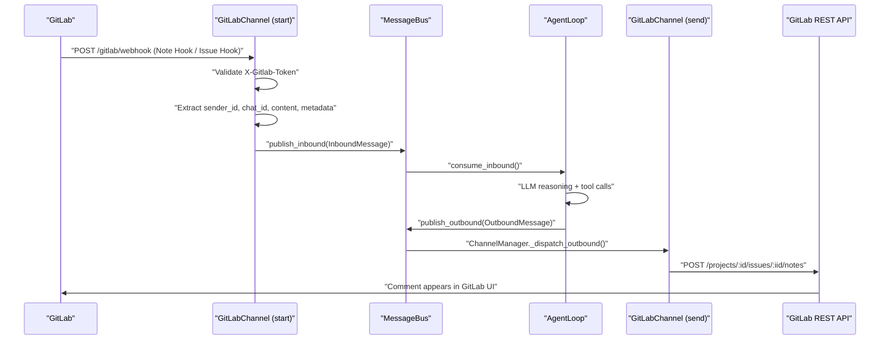

# Integrating GitLab Webhooks & API as a Chat Channel in nanobot

This is a well-scoped feature because nanobot uses a clean **plugin-based channel architecture**. You would add GitLab as a new channel — exactly the same pattern as Discord, Slack, or Feishu — where **GitLab webhook events become inbound messages** and **GitLab API comments become outbound replies**.

---

## How the Channel System Works (the pattern you follow)

Every chat integration in nanobot is a subclass of `BaseChannel`, which provides three abstract methods you must implement: [1](#0-0) 

Messages flow through a central `MessageBus` with inbound and outbound async queues: [2](#0-1) 

The `InboundMessage` carries a `channel`, `sender_id`, `chat_id`, `content`, and a flexible `metadata` dict. Crucially, `session_key` is `"{channel}:{chat_id}"` — this is what keeps conversation context separate per issue/MR: [3](#0-2) 

The `_handle_message()` helper on `BaseChannel` does permission checking and pushes to the bus — you call this from your webhook handler: [4](#0-3) 

The `ChannelManager` dispatches outbound messages back to the right channel's `send()`: [5](#0-4) 

---

## What You Need to Build

### Step 1 — Add `GitLabConfig` to the config schema (`nanobot/config/schema.py`)

You add a new Pydantic config class alongside the existing ones like `SlackConfig` and `DiscordConfig`: [6](#0-5) 

Your `GitLabConfig` would need fields such as:
- `enabled: bool`
- `gitlab_url: str` — your GitLab instance URL (e.g. `https://gitlab.com`)
- `token: str` — a GitLab Personal Access Token (PAT) or bot token with `api` scope, used to post reply comments
- `webhook_secret: str` — the token set in your GitLab webhook configuration; nanobot validates every incoming `X-Gitlab-Token` header against this
- `webhook_host: str` / `webhook_port: int` — where nanobot listens for GitLab's HTTP POST requests
- `webhook_path: str` — e.g. `/gitlab/webhook`
- `bot_username: str` — GitLab username of the bot account (to avoid the bot replying to itself)
- `allow_from: list[str]` — allowed GitLab usernames

Then add `gitlab: GitLabConfig` to `ChannelsConfig`: [7](#0-6) 

---

### Step 2 — Create `nanobot/channels/gitlab.py`

The class structure mirrors the existing channels. Here's how each part maps:

#### `start()` — Run an async HTTP webhook server

GitLab pushes events to your server over HTTP. Unlike Discord (which uses a persistent WebSocket gateway) or Feishu (which uses a WebSocket long-connection), GitLab uses plain HTTPS webhooks. You start an `aiohttp.web` server (add `aiohttp` to `pyproject.toml` dependencies) that:

1. Listens on the configured `webhook_host:webhook_port/webhook_path`
2. Validates `X-Gitlab-Token` header against your `webhook_secret`
3. Parses the `X-Gitlab-Event` header to determine event type (`Note Hook`, `Issue Hook`, `Merge Request Hook`, `Push Hook`)
4. Extracts `sender_id` (username), `chat_id` (constructed as e.g. `"{project_id}:issue:{iid}"`), and `content` (comment body or issue description)
5. Stores routing metadata (project ID, issue/MR IID, noteable type) in `metadata["gitlab"]` so `send()` knows where to post the reply
6. Calls `await self._handle_message(...)` to push to the bus

For reference, here is how Discord handles its long-running gateway loop in `start()`: [8](#0-7) 

And how Feishu runs its SDK in a background thread and keeps `start()` alive: [9](#0-8) 

Your GitLab `start()` would use `aiohttp.web.Application` + `aiohttp.web.TCPSite` wrapped in a `while self._running` loop, similarly keeping alive until `stop()` is called.

#### `send()` — Post a reply comment via GitLab REST API

The `OutboundMessage` will have the `chat_id` and `metadata["gitlab"]` set earlier. Using `httpx.AsyncClient` (already a dependency), you call:
- `POST /projects/:id/issues/:issue_iid/notes` for issue threads
- `POST /projects/:id/merge_requests/:mr_iid/notes` for MR threads

The `httpx` client is already used this way in the Discord channel: [10](#0-9) 

#### `is_allowed()` — Permission check

The base class `is_allowed()` checks `allow_from` by `sender_id` — GitLab username will work here directly: [11](#0-10) 

---

### Step 3 — Register GitLab in `ChannelManager` (`nanobot/channels/manager.py`)

Add a block identical in structure to the other channel initializations: [12](#0-11) 

Your block would check `self.config.channels.gitlab.enabled`, import `GitLabChannel`, instantiate it, and add it to `self.channels["gitlab"]`.

---

### Step 4 — Add `aiohttp` to `pyproject.toml`

The existing HTTP client is `httpx` (client-side only). For the webhook HTTP *server*, add `aiohttp`: [13](#0-12) 

Add `"aiohttp>=3.9.0,<4.0.0"` to the `dependencies` list, or alternatively into an optional extra like `[gitlab]`.

---

## Full Data Flow Diagram



---

## Event Types That Map to "Chat"

| GitLab Webhook Event | `X-Gitlab-Event` Header | What it is |
|---|---|---|
| Issue comment | `Note Hook` (noteable_type=Issue) | Primary: "@bot help me" in an issue |
| MR comment | `Note Hook` (noteable_type=MergeRequest) | Primary: "@bot review this" in an MR |
| New issue opened | `Issue Hook` | Optional: treat new issues as agent tasks |
| Push event | `Push Hook` | Optional: CI/CD awareness trigger |

The `chat_id` should encode the conversation context uniquely, e.g.:
- `"{project_id}:issue:{issue_iid}"` → keeps issue conversation history separate
- `"{project_id}:mr:{mr_iid}"` → keeps MR conversation history separate

This leverages the existing session key mechanism: [14](#0-13) 

---

## Notes

- **No public IP needed if you use a tunnel**: During development, use `ngrok` or Cloudflare Tunnel to expose your local `webhook_port` to GitLab. In production, nanobot would run on a server with a public endpoint.
- **GitLab token header vs. GitHub HMAC**: GitLab validates webhooks with a plain-text token in `X-Gitlab-Token` (not HMAC-SHA256 like GitHub), so verification is a simple string comparison against your `webhook_secret`.
- **Bot self-reply prevention**: Always check `event["user"]["username"] != self.config.bot_username` before calling `_handle_message()`, exactly like Discord skips bot authors: [15](#0-14) 
- **Threading note**: If you use the GitLab Python SDK (python-gitlab) which is synchronous, use `loop.run_in_executor()` for API calls — exactly as Feishu does for its sync SDK: [16](#0-15) 
- **`httpx` is already available** as a project dependency, so you can use `httpx.AsyncClient` for GitLab REST API calls without adding a new dependency for the outbound side.

### Citations

**File:** nanobot/channels/base.py (L12-59)
```python
class BaseChannel(ABC):
    """
    Abstract base class for chat channel implementations.
    
    Each channel (Telegram, Discord, etc.) should implement this interface
    to integrate with the nanobot message bus.
    """
    
    name: str = "base"
    
    def __init__(self, config: Any, bus: MessageBus):
        """
        Initialize the channel.
        
        Args:
            config: Channel-specific configuration.
            bus: The message bus for communication.
        """
        self.config = config
        self.bus = bus
        self._running = False
    
    @abstractmethod
    async def start(self) -> None:
        """
        Start the channel and begin listening for messages.
        
        This should be a long-running async task that:
        1. Connects to the chat platform
        2. Listens for incoming messages
        3. Forwards messages to the bus via _handle_message()
        """
        pass
    
    @abstractmethod
    async def stop(self) -> None:
        """Stop the channel and clean up resources."""
        pass
    
    @abstractmethod
    async def send(self, msg: OutboundMessage) -> None:
        """
        Send a message through this channel.
        
        Args:
            msg: The message to send.
        """
        pass
```

**File:** nanobot/channels/base.py (L61-84)
```python
    def is_allowed(self, sender_id: str) -> bool:
        """
        Check if a sender is allowed to use this bot.
        
        Args:
            sender_id: The sender's identifier.
        
        Returns:
            True if allowed, False otherwise.
        """
        allow_list = getattr(self.config, "allow_from", [])
        
        # If no allow list, allow everyone
        if not allow_list:
            return True
        
        sender_str = str(sender_id)
        if sender_str in allow_list:
            return True
        if "|" in sender_str:
            for part in sender_str.split("|"):
                if part and part in allow_list:
                    return True
        return False
```

**File:** nanobot/channels/base.py (L86-124)
```python
    async def _handle_message(
        self,
        sender_id: str,
        chat_id: str,
        content: str,
        media: list[str] | None = None,
        metadata: dict[str, Any] | None = None
    ) -> None:
        """
        Handle an incoming message from the chat platform.
        
        This method checks permissions and forwards to the bus.
        
        Args:
            sender_id: The sender's identifier.
            chat_id: The chat/channel identifier.
            content: Message text content.
            media: Optional list of media URLs.
            metadata: Optional channel-specific metadata.
        """
        if not self.is_allowed(sender_id):
            logger.warning(
                "Access denied for sender {} on channel {}. "
                "Add them to allowFrom list in config to grant access.",
                sender_id, self.name,
            )
            return
        
        msg = InboundMessage(
            channel=self.name,
            sender_id=str(sender_id),
            chat_id=str(chat_id),
            content=content,
            media=media or [],
            metadata=metadata or {}
        )
        
        await self.bus.publish_inbound(msg)
    
```

**File:** nanobot/bus/queue.py (L8-35)
```python
class MessageBus:
    """
    Async message bus that decouples chat channels from the agent core.

    Channels push messages to the inbound queue, and the agent processes
    them and pushes responses to the outbound queue.
    """

    def __init__(self):
        self.inbound: asyncio.Queue[InboundMessage] = asyncio.Queue()
        self.outbound: asyncio.Queue[OutboundMessage] = asyncio.Queue()

    async def publish_inbound(self, msg: InboundMessage) -> None:
        """Publish a message from a channel to the agent."""
        await self.inbound.put(msg)

    async def consume_inbound(self) -> InboundMessage:
        """Consume the next inbound message (blocks until available)."""
        return await self.inbound.get()

    async def publish_outbound(self, msg: OutboundMessage) -> None:
        """Publish a response from the agent to channels."""
        await self.outbound.put(msg)

    async def consume_outbound(self) -> OutboundMessage:
        """Consume the next outbound message (blocks until available)."""
        return await self.outbound.get()

```

**File:** nanobot/bus/events.py (L8-36)
```python
@dataclass
class InboundMessage:
    """Message received from a chat channel."""
    
    channel: str  # telegram, discord, slack, whatsapp
    sender_id: str  # User identifier
    chat_id: str  # Chat/channel identifier
    content: str  # Message text
    timestamp: datetime = field(default_factory=datetime.now)
    media: list[str] = field(default_factory=list)  # Media URLs
    metadata: dict[str, Any] = field(default_factory=dict)  # Channel-specific data
    
    @property
    def session_key(self) -> str:
        """Unique key for session identification."""
        return f"{self.channel}:{self.chat_id}"


@dataclass
class OutboundMessage:
    """Message to send to a chat channel."""
    
    channel: str
    chat_id: str
    content: str
    reply_to: str | None = None
    media: list[str] = field(default_factory=list)
    metadata: dict[str, Any] = field(default_factory=dict)

```

**File:** nanobot/channels/manager.py (L34-138)
```python
    def _init_channels(self) -> None:
        """Initialize channels based on config."""
        
        # Telegram channel
        if self.config.channels.telegram.enabled:
            try:
                from nanobot.channels.telegram import TelegramChannel
                self.channels["telegram"] = TelegramChannel(
                    self.config.channels.telegram,
                    self.bus,
                    groq_api_key=self.config.providers.groq.api_key,
                )
                logger.info("Telegram channel enabled")
            except ImportError as e:
                logger.warning("Telegram channel not available: {}", e)
        
        # WhatsApp channel
        if self.config.channels.whatsapp.enabled:
            try:
                from nanobot.channels.whatsapp import WhatsAppChannel
                self.channels["whatsapp"] = WhatsAppChannel(
                    self.config.channels.whatsapp, self.bus
                )
                logger.info("WhatsApp channel enabled")
            except ImportError as e:
                logger.warning("WhatsApp channel not available: {}", e)

        # Discord channel
        if self.config.channels.discord.enabled:
            try:
                from nanobot.channels.discord import DiscordChannel
                self.channels["discord"] = DiscordChannel(
                    self.config.channels.discord, self.bus
                )
                logger.info("Discord channel enabled")
            except ImportError as e:
                logger.warning("Discord channel not available: {}", e)
        
        # Feishu channel
        if self.config.channels.feishu.enabled:
            try:
                from nanobot.channels.feishu import FeishuChannel
                self.channels["feishu"] = FeishuChannel(
                    self.config.channels.feishu, self.bus
                )
                logger.info("Feishu channel enabled")
            except ImportError as e:
                logger.warning("Feishu channel not available: {}", e)

        # Mochat channel
        if self.config.channels.mochat.enabled:
            try:
                from nanobot.channels.mochat import MochatChannel

                self.channels["mochat"] = MochatChannel(
                    self.config.channels.mochat, self.bus
                )
                logger.info("Mochat channel enabled")
            except ImportError as e:
                logger.warning("Mochat channel not available: {}", e)

        # DingTalk channel
        if self.config.channels.dingtalk.enabled:
            try:
                from nanobot.channels.dingtalk import DingTalkChannel
                self.channels["dingtalk"] = DingTalkChannel(
                    self.config.channels.dingtalk, self.bus
                )
                logger.info("DingTalk channel enabled")
            except ImportError as e:
                logger.warning("DingTalk channel not available: {}", e)

        # Email channel
        if self.config.channels.email.enabled:
            try:
                from nanobot.channels.email import EmailChannel
                self.channels["email"] = EmailChannel(
                    self.config.channels.email, self.bus
                )
                logger.info("Email channel enabled")
            except ImportError as e:
                logger.warning("Email channel not available: {}", e)

        # Slack channel
        if self.config.channels.slack.enabled:
            try:
                from nanobot.channels.slack import SlackChannel
                self.channels["slack"] = SlackChannel(
                    self.config.channels.slack, self.bus
                )
                logger.info("Slack channel enabled")
            except ImportError as e:
                logger.warning("Slack channel not available: {}", e)

        # QQ channel
        if self.config.channels.qq.enabled:
            try:
                from nanobot.channels.qq import QQChannel
                self.channels["qq"] = QQChannel(
                    self.config.channels.qq,
                    self.bus,
                )
                logger.info("QQ channel enabled")
            except ImportError as e:
                logger.warning("QQ channel not available: {}", e)
```

**File:** nanobot/channels/manager.py (L185-208)
```python
    async def _dispatch_outbound(self) -> None:
        """Dispatch outbound messages to the appropriate channel."""
        logger.info("Outbound dispatcher started")
        
        while True:
            try:
                msg = await asyncio.wait_for(
                    self.bus.consume_outbound(),
                    timeout=1.0
                )
                
                channel = self.channels.get(msg.channel)
                if channel:
                    try:
                        await channel.send(msg)
                    except Exception as e:
                        logger.error("Error sending to {}: {}", msg.channel, e)
                else:
                    logger.warning("Unknown channel: {}", msg.channel)
                    
            except asyncio.TimeoutError:
                continue
            except asyncio.CancelledError:
                break
```

**File:** nanobot/config/schema.py (L143-157)
```python
class SlackConfig(Base):
    """Slack channel configuration."""

    enabled: bool = False
    mode: str = "socket"  # "socket" supported
    webhook_path: str = "/slack/events"
    bot_token: str = ""  # xoxb-...
    app_token: str = ""  # xapp-...
    user_token_read_only: bool = True
    reply_in_thread: bool = True
    react_emoji: str = "eyes"
    group_policy: str = "mention"  # "mention", "open", "allowlist"
    group_allow_from: list[str] = Field(default_factory=list)  # Allowed channel IDs if allowlist
    dm: SlackDMConfig = Field(default_factory=SlackDMConfig)

```

**File:** nanobot/config/schema.py (L168-179)
```python
class ChannelsConfig(Base):
    """Configuration for chat channels."""

    whatsapp: WhatsAppConfig = Field(default_factory=WhatsAppConfig)
    telegram: TelegramConfig = Field(default_factory=TelegramConfig)
    discord: DiscordConfig = Field(default_factory=DiscordConfig)
    feishu: FeishuConfig = Field(default_factory=FeishuConfig)
    mochat: MochatConfig = Field(default_factory=MochatConfig)
    dingtalk: DingTalkConfig = Field(default_factory=DingTalkConfig)
    email: EmailConfig = Field(default_factory=EmailConfig)
    slack: SlackConfig = Field(default_factory=SlackConfig)
    qq: QQConfig = Field(default_factory=QQConfig)
```

**File:** nanobot/channels/discord.py (L59-81)
```python
    async def start(self) -> None:
        """Start the Discord gateway connection."""
        if not self.config.token:
            logger.error("Discord bot token not configured")
            return

        self._running = True
        self._http = httpx.AsyncClient(timeout=30.0)

        while self._running:
            try:
                logger.info("Connecting to Discord gateway...")
                async with websockets.connect(self.config.gateway_url) as ws:
                    self._ws = ws
                    await self._gateway_loop()
            except asyncio.CancelledError:
                break
            except Exception as e:
                logger.warning("Discord gateway error: {}", e)
                if self._running:
                    logger.info("Reconnecting to Discord gateway in 5 seconds...")
                    await asyncio.sleep(5)

```

**File:** nanobot/channels/discord.py (L98-145)
```python
    async def send(self, msg: OutboundMessage) -> None:
        """Send a message through Discord REST API."""
        if not self._http:
            logger.warning("Discord HTTP client not initialized")
            return

        url = f"{DISCORD_API_BASE}/channels/{msg.chat_id}/messages"
        headers = {"Authorization": f"Bot {self.config.token}"}

        try:
            chunks = _split_message(msg.content or "")
            if not chunks:
                return

            for i, chunk in enumerate(chunks):
                payload: dict[str, Any] = {"content": chunk}

                # Only set reply reference on the first chunk
                if i == 0 and msg.reply_to:
                    payload["message_reference"] = {"message_id": msg.reply_to}
                    payload["allowed_mentions"] = {"replied_user": False}

                if not await self._send_payload(url, headers, payload):
                    break  # Abort remaining chunks on failure
        finally:
            await self._stop_typing(msg.chat_id)

    async def _send_payload(
        self, url: str, headers: dict[str, str], payload: dict[str, Any]
    ) -> bool:
        """Send a single Discord API payload with retry on rate-limit. Returns True on success."""
        for attempt in range(3):
            try:
                response = await self._http.post(url, headers=headers, json=payload)
                if response.status_code == 429:
                    data = response.json()
                    retry_after = float(data.get("retry_after", 1.0))
                    logger.warning("Discord rate limited, retrying in {}s", retry_after)
                    await asyncio.sleep(retry_after)
                    continue
                response.raise_for_status()
                return True
            except Exception as e:
                if attempt == 2:
                    logger.error("Error sending Discord message: {}", e)
                else:
                    await asyncio.sleep(1)
        return False
```

**File:** nanobot/channels/discord.py (L221-229)
```python
    async def _handle_message_create(self, payload: dict[str, Any]) -> None:
        """Handle incoming Discord messages."""
        author = payload.get("author") or {}
        if author.get("bot"):
            return

        sender_id = str(author.get("id", ""))
        channel_id = str(payload.get("channel_id", ""))
        content = payload.get("content") or ""
```

**File:** nanobot/channels/feishu.py (L253-307)
```python
    async def start(self) -> None:
        """Start the Feishu bot with WebSocket long connection."""
        if not FEISHU_AVAILABLE:
            logger.error("Feishu SDK not installed. Run: pip install lark-oapi")
            return
        
        if not self.config.app_id or not self.config.app_secret:
            logger.error("Feishu app_id and app_secret not configured")
            return
        
        self._running = True
        self._loop = asyncio.get_running_loop()
        
        # Create Lark client for sending messages
        self._client = lark.Client.builder() \
            .app_id(self.config.app_id) \
            .app_secret(self.config.app_secret) \
            .log_level(lark.LogLevel.INFO) \
            .build()
        
        # Create event handler (only register message receive, ignore other events)
        event_handler = lark.EventDispatcherHandler.builder(
            self.config.encrypt_key or "",
            self.config.verification_token or "",
        ).register_p2_im_message_receive_v1(
            self._on_message_sync
        ).build()
        
        # Create WebSocket client for long connection
        self._ws_client = lark.ws.Client(
            self.config.app_id,
            self.config.app_secret,
            event_handler=event_handler,
            log_level=lark.LogLevel.INFO
        )
        
        # Start WebSocket client in a separate thread with reconnect loop
        def run_ws():
            while self._running:
                try:
                    self._ws_client.start()
                except Exception as e:
                    logger.warning("Feishu WebSocket error: {}", e)
                if self._running:
                    import time; time.sleep(5)
        
        self._ws_thread = threading.Thread(target=run_ws, daemon=True)
        self._ws_thread.start()
        
        logger.info("Feishu bot started with WebSocket long connection")
        logger.info("No public IP required - using WebSocket to receive events")
        
        # Keep running until stopped
        while self._running:
            await asyncio.sleep(1)
```

**File:** nanobot/channels/feishu.py (L631-637)
```python
    def _on_message_sync(self, data: "P2ImMessageReceiveV1") -> None:
        """
        Sync handler for incoming messages (called from WebSocket thread).
        Schedules async handling in the main event loop.
        """
        if self._loop and self._loop.is_running():
            asyncio.run_coroutine_threadsafe(self._on_message(data), self._loop)
```

**File:** pyproject.toml (L19-45)
```text
dependencies = [
    "typer>=0.20.0,<1.0.0",
    "litellm>=1.81.5,<2.0.0",
    "pydantic>=2.12.0,<3.0.0",
    "pydantic-settings>=2.12.0,<3.0.0",
    "websockets>=16.0,<17.0",
    "websocket-client>=1.9.0,<2.0.0",
    "httpx>=0.28.0,<1.0.0",
    "oauth-cli-kit>=0.1.3,<1.0.0",
    "loguru>=0.7.3,<1.0.0",
    "readability-lxml>=0.8.4,<1.0.0",
    "rich>=14.0.0,<15.0.0",
    "croniter>=6.0.0,<7.0.0",
    "dingtalk-stream>=0.24.0,<1.0.0",
    "python-telegram-bot[socks]>=22.0,<23.0",
    "lark-oapi>=1.5.0,<2.0.0",
    "socksio>=1.0.0,<2.0.0",
    "python-socketio>=5.16.0,<6.0.0",
    "msgpack>=1.1.0,<2.0.0",
    "slack-sdk>=3.39.0,<4.0.0",
    "slackify-markdown>=0.2.0,<1.0.0",
    "qq-botpy>=1.2.0,<2.0.0",
    "python-socks[asyncio]>=2.8.0,<3.0.0",
    "prompt-toolkit>=3.0.50,<4.0.0",
    "mcp>=1.26.0,<2.0.0",
    "json-repair>=0.57.0,<1.0.0",
]
```
